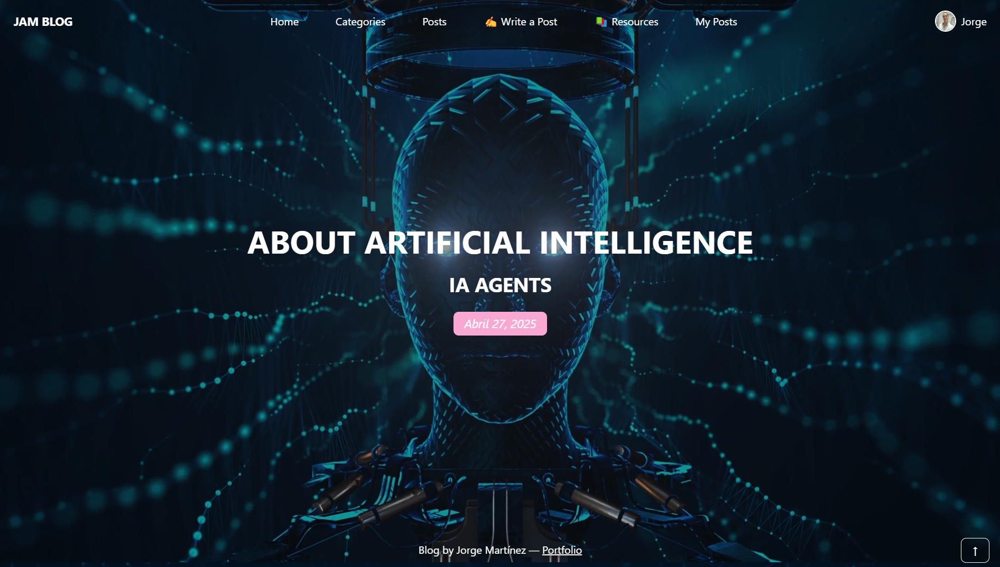
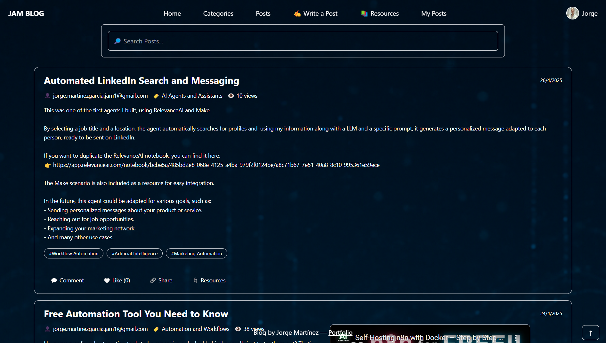
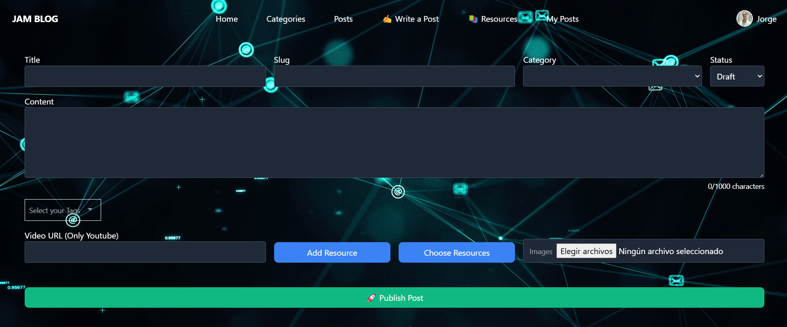
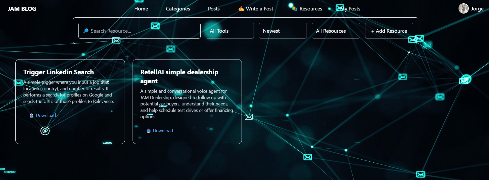
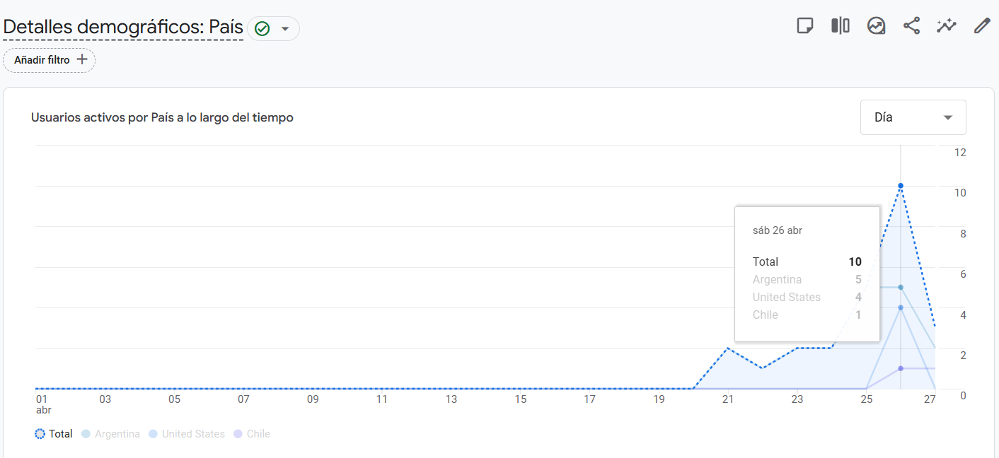

# JAM Blog







## Description

**JAM Blog** is a full-stack blogging platform built to share insights on AI agents, automation projects, and general development topics. It offers seamless post creation, real-time interaction through comments and likes, and dynamic resource handling, all wrapped in a modern, responsive design.

The project integrates a wide range of cutting-edge technologies to ensure an optimized user experience, robust backend performance, and efficient content management across devices.

## Technologies Used

### Frontend:

- **Vue.js & Vite**: For a fast and highly responsive frontend.
- **TailwindCSS**: For sleek and mobile-first UI styling.
- **Google Analytics**: To monitor and analyze website traffic.

### Backend:

- **Python & Django**: For a powerful and scalable REST API.
- **JWT (JSON Web Tokens)**: Secure authentication and authorization.
- **SendGrid**: Email notifications and communication.
- **AWS S3**: Storage for profile pictures and post resources.
- **AWS Elastic Beanstalk + CloudFront**: Hosting the backend API.

### Database:

- **MySQL**: Storing and managing user data, posts, comments, likes, and categories.

## Deployment

- **Backend**: Hosted on **AWS Elastic Beanstalk + CloudFront**.
- **Frontend**: Hosted on **AWS S3 + CloudFront**.
- **Database**: Hosted on **AWS RDS (MySQL)**.

## Key Features

- **Create and Manage Posts**: Write, edit, and delete blog posts easily.
- **Embedded YouTube Videos**: Seamlessly add video content to posts.
- **Comments and Likes**: Users can interact by commenting and liking posts.
- **Post Sharing**: Share posts via unique URLs.
- **Advanced Filtering**: Search and filter posts by keyword, category, and date.

## How to Run the Application

### **Clone the Repository**

```bash
git clone https://github.com/yourusername/jam-blog.git
cd jam-blog
```

### **Install Dependencies**

```bash
cd backend
pip install -r requirements.txt
python manage.py migrate
python manage.py runserver
cd ../frontend
npm install
```

### **Set Up Environment Variables**

Create a `.env` file in both the **backend** and **frontend** directories.

#### **Backend Variables**

```env
DJANGO_SECRET_KEY=Your Django secret key.
MYSQL_DATABASE=Your MySQL database name.
MYSQL_USER=Your MySQL database username.
MYSQL_PASSWORD=Your MySQL database password.
MYSQL_HOST=Your MySQL host URL.
AWS_STORAGE_BUCKET_NAME=AWS S3 bucket name for resources and images.
AWS_ACCESS_KEY_ID=AWS access key.
AWS_SECRET_ACCESS_KEY=AWS secret access key.
SENDGRID_API_KEY=SendGrid API key for sending emails.
FRONTEND_URL=Frontend application URL.
```

#### **Frontend Variables**

```env
VITE_API_URL=Backend API base URL.
VITE_GOOGLE_ANALYTICS_ID=Google Analytics ID.
```

### **Run the Application**

```bash
# Frontend
cd frontend
npm run dev

# Backend
cd backend
python manage.py runserver
```
